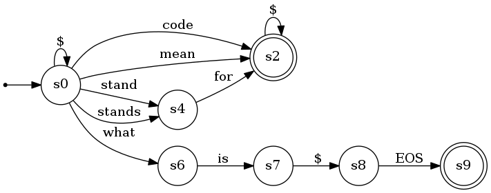

# RE2RNN
Source code for the EMNLP2020 paper: "[Cold-start and Interpretability: Turning Regular Expressions into Trainable Recurrent Neural Networks](http://faculty.sist.shanghaitech.edu.cn/faculty/tukw/emnlp20reg.pdf)", Chengyue Jiang, Yinggong Zhao, Shanbo Chu, Libin Shen, and Kewei Tu. 
## Citation
```
@inproceedings{jiang-etal-2020-cold,
    title = "Cold-start and Interpretability: Turning Regular Expressions into Trainable Recurrent Neural Networks",
    author = "Jiang, Chengyue  and
      Zhao, Yinggong  and
      Chu, Shanbo  and
      Shen, Libin  and
      Tu, Kewei",
    booktitle = "Proceedings of the 2020 Conference on Empirical Methods in Natural Language Processing (EMNLP)",
    month = nov,
    year = "2020",
    address = "Online",
    publisher = "Association for Computational Linguistics",
    url = "https://www.aclweb.org/anthology/2020.emnlp-main.258",
    pages = "3193--3207",
}
```

## Requirements
- pytorch 1.3.1
- tensorly 0.5.0
- numpy
- tqdm
- automata-tools
- pyparsing

## Data
Raw dataset files, preprocessed dataset files, glove word embedding matrix, rules for each dataset, and the decomposed automata files can be downloaded here: 
[Google Drive](https://drive.google.com/file/d/1r8pMu8EwDjys8-6nHFiEJs4QtelhGqY8/view?usp=sharing), 
[Tencent Drive](https://share.weiyun.com/V8TxDWui).

You can download and extract the zip file, and replace the original data directory. The directory structure should be:
```commandline
.
├── data
│   ├── ATIS
│   │   ├── automata
│   │   ├── ....
│   ├── TREC
│   │   ├── automata
│   │   ├── ....
│   ├── ....
├── src
│   ├── ....
├── src_simple
│   ├── ....
├── model
│   ├── ....
├── imgs
│   ├── ....
``` 

If you have done these, you can skip to the training part.

## Regular Expressions
We provide the RE rules for three datasets, ATIS, QC(TREC-6) and SMS. Our REs are word-level, not char-level. We show the symbols and their meanings in the following table.

|Symbol|Meaning|
|----|----|
|$|wildcard|
|%|numbers, e.g. 5, 1996|
|&|punctuations|
|?|0 or 1 occurrence|
|*|zero or more occurrences|
|+|one or more occurrences|
|(a<code>&#124;</code>b)|a or b |

### Regular expressions Examples
ATIS - abbreviation label.
```commandline
[abbreviation]
( $ * ( mean | ( stand | stands ) for | code ) $ * ) | ( $ * what is $ EOS )
```
SMS - spam label.
```commandline
[spam]
$ * dating & * $ * call $*
```

## Regular Expression to FA
We show examples on ATIS dataset, for other datasets, simply change --dataset option to TREC or SMS.
### prepare the dataset
You need first download the [GloVe 6B](http://nlp.stanford.edu/data/wordvecs/glove.6B.zip) embeddings, and place the embedding files into ```data/emb/glove.6B/```
You can also prepare the dataset from the raw dataset by running the following command.
```commandline
python data.py --dataset ATIS
```

### RE to FA
We turn the regular expressions into a finite automaton using our automata-tools package implemented by (@[linonetwo](https://github.com/linonetwo)).
This tool is modified based on https://github.com/sdht0/automata-from-regex. 
This package require the 'dot' command for drawing the automata.

Or running the following command to convert REs/reversed RE (for backward direction) to FA.
```commandline
python create_automata.py --dataset ATIS --automata_name all --reversed 0
python create_automata.py --dataset ATIS --automata_name all --reversed 1
```
The regular expression for ATIS - abbreviation mentioned above can be represented using following automaton.


### Run the REs
The RE system's result is got by running the un-decomposed automaton you just created.
```commandline
python main.py --model_type Onehot --dataset ATIS --only_probe 1 --wfa_type viterbi \
--epoch 0 --automata_path_forward all.1105155534-1604591734.6171093.split.pkl --seed 0
```

### Decomposing FAs
We convert the FAs using tensor-rank decomposition.

Run the following command to convert REs to FA.
```commandline
python decompose_automata.py --dataset ATIS --automata_name automata_name --rank 150 --init svd
```

## FAs to FA-RNN and training FA-RNN.
To train the initialize the FA-RNNs on ATIS, SMS, and TREC make sure you finish the above steps. Then let's train an FA-RNN initialized by the decomposed automata.
If you have downloaded automata and place them into the right location, you can run.

```commandline
python main.py --dataset ATIS --run save_dir --model_type FSARNN --beta 0.9 \
 --wfa_type forward --seed 0 --lr 0.001 --bidirection 0 --farnn 0 --random 0
```
Please check the function ```get_automata_from_seed``` in ```utils/utils.py``` to understand which automaton you are using.


If you use newly decomposed automata, you need to specify the ```--automata_path_forward``` and ```--automata_path_backward``` options.

For example: FARNN
```commandline
python main.py --dataset ATIS --run save_dir --model_type FSARNN --bidirection 0 \
--beta 0.9 --wfa_type forward --seed 0 --lr 0.001 --farnn 0 --normalize_automata l2 \
--automata_path_forward automata.newrule.split.randomseed150.False.0.0003.0.pkl
```
For example: BiFARNN
```commandline
python main.py --dataset ATIS --run save_dir --model_type FSARNN --bidirection 1 \
--beta 0.9 --wfa_type forward --seed 0 --lr 0.001 --farnn 0 --normalize_automata l2 \
--automata_path_forward automata.newrule.split.randomseed150.False.0.0003.0.pkl \
--automata_path_backward automata.newrule.reversed.randomseed150.False.0.0735.0.pkl
```
For example: FAGRU
```commandline
python main.py --dataset ATIS --run save_dir --model_type FSARNN --bidirection 0 \
--beta 0.9 --wfa_type forward --seed 0 --lr 0.001 --farnn 1 --normalize_automata l2 \
--automata_path_forward automata.newrule.split.randomseed150.False.0.0003.0.pkl
```
We also remove some options and unimportant code to provide a cleaner version of code in ```/src_simple```, in which only contains FARNN related code.
As an example: 
```commandline
python main_min.py --dataset ATIS --run save_dir --model_type FSARNN --beta 0.3
```

## Interpretability and Models.
You first need to download the FA-RNN models and config files here:
[Google Drive](https://drive.google.com/file/d/1q_Bxv2ptCuo_-mLKnd25jCYv6yuYlP4k/view?usp=sharing), 
[Tencent Drive](https://share.weiyun.com/lC1TnsIy).
Please place the files in the ```/model``` directory.

To seed the log and hyper-parameters of these provided model, simple using pickle to load the .res config files.
For example, to achieve the hyper-params for model D0.9739-T0.9653-DI0.8655-TI0.8645-1106095843-1604656723.555744-ATIS-0.model, you can run:

```
import pickle
pickle.load(open('1106095843-1604656723.5809364.res', 'rb'))
```

Note that some useless hyper-parameters in the config files are cleaned in the final version/simple version, so the config file may not be directly used, just filter out the useless hyper-params. 


We provide several examples showing how to convert the trained model parameters back into WFAs, and threshold them into NFA.
See the file ```jupyter/checkTrainedRules.ipynb```.


